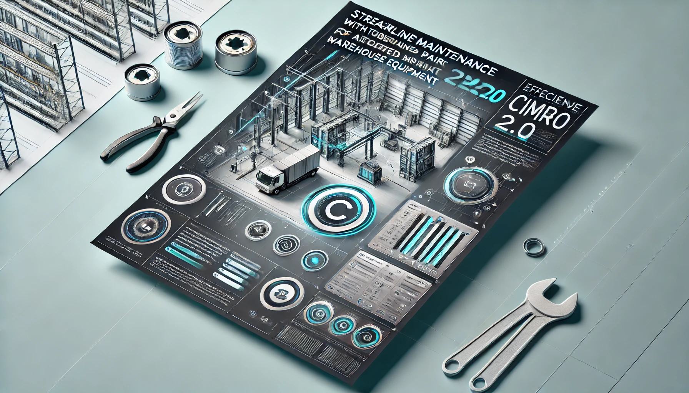

# SLavaSOFT.NET

<!---->

Welcome to SLavaSOFT.NET! We develop innovative solutions for automating and optimizing the operations of industrial enterprises. Our flagship product is Cimro 2.0, an application for managing the modernization and maintenance department of automated warehouse systems.

## Cimro 2.0 Revolutionizing Warehouse Maintenance Management

**Cimro 2.0** is a comprehensive solution designed to improve the efficiency of departments responsible for the modernization and maintenance of automated warehouse systems. We understand how critical seamless warehouse operation is for modern business, and Cimro 2.0 provides the tools needed to achieve this goal.

### Key Features

*   **Request Management:** Centralized management of service and modernization requests, with the ability to track status and prioritize.
*   **Task Planning and Assignment:** Intelligent work planning and assignment of performers, considering their qualifications and availability.
*   **Resource Management:** Full control over used resources, including spare parts, tools, and consumables.
*   **Knowledge Management:** Creating and maintaining a knowledge base of warehousing systems, typical malfunctions, and methods for their elimination.
*   **Mobile App:** Access to information and the ability to perform tasks directly in the warehouse via a mobile application (planned).
*   **Analytics and Reporting:** Powerful tools for analyzing data on the department's work, identifying bottlenecks, and making informed management decisions.
*   **Integration:** Easy integration with existing enterprise management systems (ERP, MES).
*   **User-Friendly Interface:** An intuitive and modern interface that does not require lengthy training.

### Why Cimro 2.0?

*   **Reduced Downtime:** Fast response to incidents and efficient planning of preventive maintenance.
*   **Optimized Costs:** Reduced maintenance and repair costs by optimizing resource utilization.
*   **Increased Productivity:** Increased productivity of the maintenance department and, as a result, the warehouse as a whole.
*   **Improved Safety:** Prevention of emergency situations and ensuring the safe operation of warehouse equipment.
*   **Scalability:** Cimro 2.0 easily adapts to the needs of your business, regardless of its size.

## Installation and Usage

Detailed instructions for installing and configuring Cimro 2.0 can be found in the [documentation](./Resources/Installation.md).

## Contributing

We welcome community contributions to the development of Cimro 2.0! If you want to help us improve the application, please read the [contribution guide](./Resources/Contributing.md).

Possible areas for contribution:

*   Bug reports and improvement suggestions
*   Development of new features
*   Translation of documentation into other languages
*   Writing tests
*   Improving the user interface

## Roadmap

We are constantly working on improving Cimro 2.0 and plan to introduce the following features in the near future:

*   **Integration with Equipment:** Real-time equipment condition monitoring and predictive maintenance.
*   **Using Machine Learning:** Automatic fault diagnosis and optimization of maintenance schedules.
*   **Advanced Reporting Capabilities:** Deeper data analysis and customizable reports.

## Contact

*   Email: [SLavaSOFT.NET@gmali.com](mailto:slavasoft.net@gmail.com)
*   GitHub: [https://github.com/SLavaSOFT.NET](https://github.com/SLavaSOFT.NET)

## Acknowledgments

We thank all contributors and users of Cimro 2.0 for their support and assistance in the development of the product!

---

© 2012 SLavaSOFT.NET
